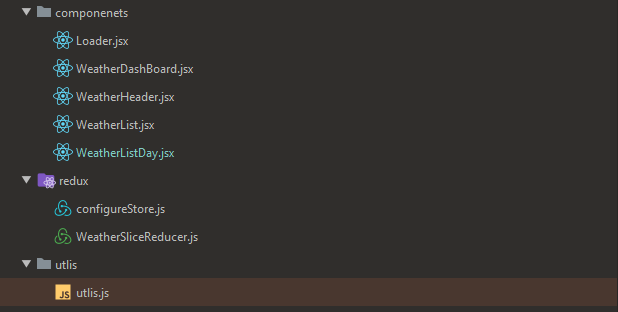
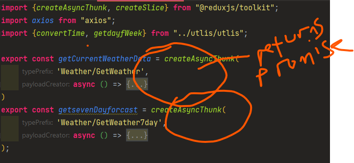
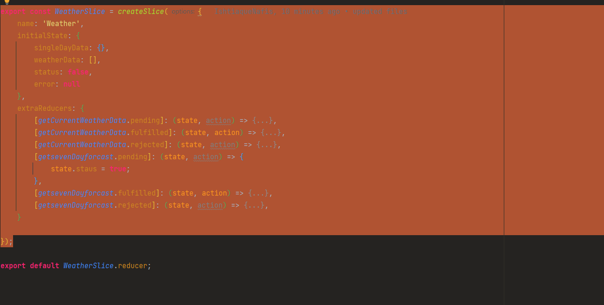
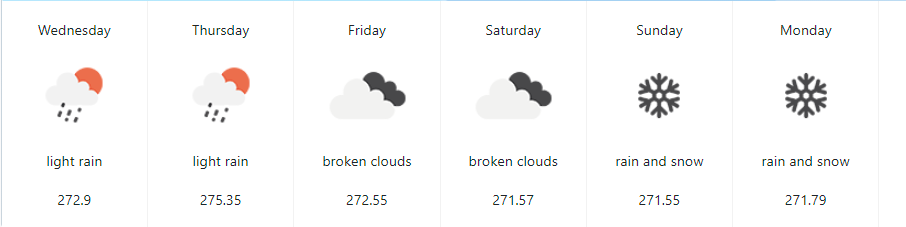

### File Strucutre



### components

- loader = inidactes loading
- WeatherDashBoard - dashboard where it will lead to WeatherListDay
- WeatherList -> holds all the weathers in array form
- WeatherHeader-> holds current day weather information
- WeatherListDay -> holds 7 day forcast for weather information.

### redux

-configureStore = configureStore for redux. so it can be used.

- WeatherSliceReducer -> this holds all the information for global state.

### Utlis

- holds helper function.

# Weather Slice reducer explained.



-- both of thesse functions returns a promoise


-redux-toolkit gives it acees to do await,promoise and reject easily.

## WeatherList Componenet

```
 const {singleDayData, weatherData, status, error} = useSelector(state => state.weather);

    const dispatch = useDispatch();

    useEffect(() => {
        dispatch(getCurrentWeatherData())
    }, [dispatch])

```

- extracting information needed.
- and dispatching via dispatch here. return (

```
  <div className="col-lg-8 grid-margin stretch-card">

            <div className="card card-weather">

                <WeatherHeader singleweather={singleDayData}/>

                <WeatherListDay/>

            </div>
        </div>
  )

```

-- weather header is getting all the items.

### WeatherHeader

```
import React from 'react';

const WeatherHeader = ({singleweather}) => {

    return (
        <>
            <div className="card-body">
                <div className="weather-date-location">
                    <h3>{singleweather.date}</h3>
                    <p className="text-gray"> {singleweather.name}<span
                        className="weather-location"></span>{}</p>
                </div>
                <div className="weather-data d-flex">
                    <div className="mr-auto">
                        <h4 className="display-3">{singleweather.temp} <span className="symbol">°</span>C</h4>
                        <p> {singleweather.description} </p>
                        

                    </div>
                </div>
            </div>
        </>
    );
};

export default WeatherHeader;

```

- all the information is being rendered here,

### WeatherListDay componenet


```
import React, {useEffect} from 'react';
import {useDispatch, useSelector} from "react-redux";
import {getsevenDayforcast} from "../redux/WeatherSliceReducer";
import Loader from "./Loader";

const WeatherListDay = () => {
    const {weatherData, status, error} = useSelector(state => state.weather);

    const dispatch = useDispatch();

    useEffect(() => {
        dispatch(getsevenDayforcast());
    }, [dispatch]);

    if ((status && weatherData?.length > 0)) return <Loader/>


    return (
        <div className="card-body p-0">

            <div className="d-flex weakly-weather">
                {weatherData.map((
                    weather => <div className="weakly-weather-item" key={weather.temp}>
                        <p className="mb-0"> {weather.date} </p>
                        
                        <p>{weather.description}</p>
                        <p className="mb-0"> {weather.temp} </p>
                    </div>))}


            </div>
        </div>

    );
};

export default WeatherListDay;


```

- dispatch is being activated on use effect
- weatherData is an array and will be looped through. 

-seven day forcast is being rendered
  


